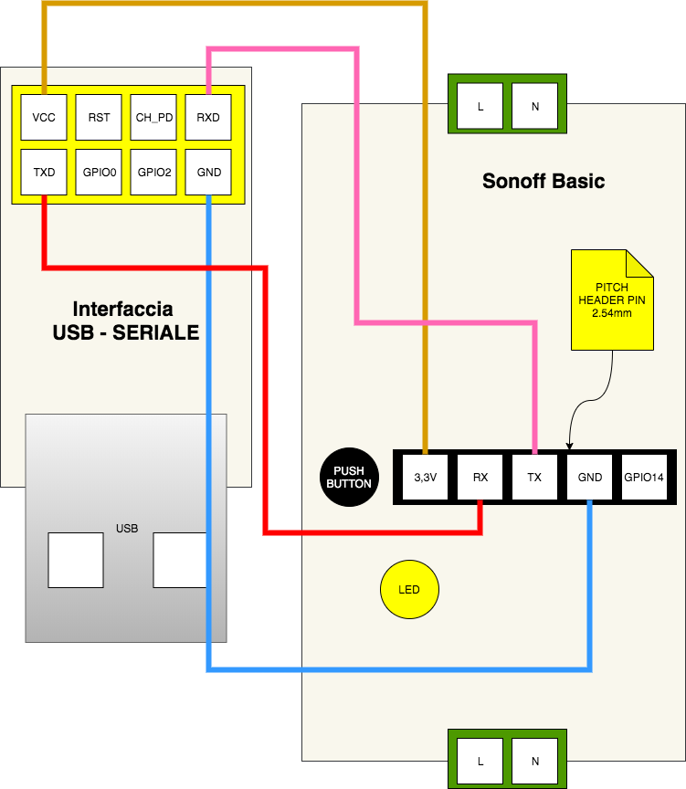
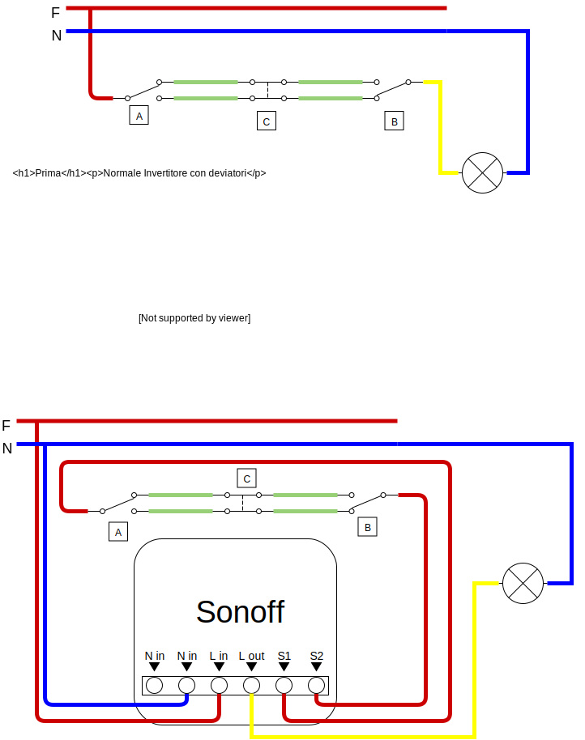

# Sonoff

Deploy del firmware Tasmota su nuovo device

In questo capitolo si esplora ciò che è necessario fare dal momento della ricezione del dispositivo al momento in cui questo è pronto per l'installazione in un impianto.

Si assume MAC OSX


## Operazioni iniziali


### Prerequisiti

Installare esptool. Su mac osx si può installarlo con brew.

```bash
brew install esptool
```

- Instalare VS Code
- Installare VS Code Platform.io (estensione)


### Saldatura header

Al fine di poter collegare l'interfaccia USB-SERIALE al Sonoff è necessario saldare sulla scheda un pitch header a 4 pin da 2.54mm.


### Schema di collegamento

Nel mio caso, l'interfaccia USB-SERIALE è predisposta per l'inserimento diretto di un ESP-8266, da questo si può derivare la distribuzione dei piedini





### Preparazione di una custom build

#### Step

```
git clone	https://github.com/arendst/Tasmota.git
cd Tasmota
git checkout master
cp sonoff/user_config_override_sample.h sonoff/user_config_override.h
```

Editare poi sia il file **platformio.ini** che il file appena creato: **user_config_override.h**. Nel primo file bisogna fare in modo di configurare il processo di build in modo che sia prodotta solo la build che ci interessa e che vengano recepite le configurazioni custom; nel secondo file andiamo ad inserire le configurazioni custom

##### In platformio.ini

- scommentare solo la riga **default_envs = sonoff**
- nella sezione **Optional Firmware configurations** scommentare solo **-DUSE_CONFIG_OVERRIDE**

##### In user_config_override.h

```c++
#ifndef _USER_CONFIG_OVERRIDE_H_
#define _USER_CONFIG_OVERRIDE_H_

// force the compiler to show a warning to confirm that this file is included
#warning **** user_config_override.h: Using Settings from this File ****

#ifndef USE_MQTT_TLS
#define USE_MQTT_TLS
#define USE_MQTT_TLS_CA_CERT // Optional but highly recommended
#endif
#ifndef USE_MQTT_AWS_IOT
#define USE_MQTT_AWS_IOT
#endif
#ifdef USE_DISCOVERY
#undef USE_DISCOVERY
#endif

// -- Setup your own Wifi settings  ---------------
#undef  STA_SSID1
#define STA_SSID1 "<wifi ssid>"

#undef  STA_PASS1
#define STA_PASS1 "<wifi password>"

// -- Setup your own MQTT settings  ---------------
// #undef  MQTT_HOST
// #define MQTT_HOST "<aws iot mqtt host>"

// #undef  MQTT_PORT
// #define MQTT_PORT 8883

#endif  // _USER_CONFIG_OVERRIDE_H_

```

Questa configurazione permette di caricare poi a bordo dei certificati per l'handshake previsto da AWS IoT. Il file di esempio **user_config_ovveride_sample.h** contiene comunque tutte le indicazioni necessarie alla comprensione dei parametri configurabili.

N.B. La configurazione di MQTT direttamente nella build da dei problemi. Conviene farla da terminale web appena il dispositivo è collegato alla rete.


##### Build

La build può essere lanciata direttamente dall'estensione platform.io, in alto a sinistra nel riquadro **PROJECT TASKS**, è sufficiente fare click su **Build**.

Il risultato sarà nella cartella **Tasmota/.pioenvs/sonoff/firmware.bin**


### Individuare la porta alla quale il Sonoff è collegato

Su Mac OsX si può usare il seguente comando:

```
ls /dev/{tty,cu}.*
```

eseguendo il comando prima e dopo aver collegato il Sonoff si individuerà la porta corretta.

In genere la porta **tty** viene usata per inviare dei comandi mentre la **cu** (call-up) per ricevere messaggi. Entrambe permettono un full-duplex.

A questo punto, supponendo di effettuare il resto delle operazioni nella stessa sessione del terminale, ha senso impostare le prima variabile d'ambiente per semplificare l'esecuzione dei comandi successivi

```bash
export SONOFF_SERIAL_ADDR=<indirizzo porta seriale>
export SONOFF_BUILD_PATH=<indirizzo della build da flashare>
export AWS_IOT_ENDPOINT=<endpoint mqtt aws iot>
export SONOFF_TOPIC=<topic>
```

Oppure si può creare un file con tutte le variabili d'ambiente in modo da poterlo poi recuperare facilmente con

```bash
source bash_config
```


L'indirizzo della build, se è una custom build,  è in una cartella nei sorgenti di Tasmota:   **Tasmota/.pioenvs/sonoff/firmware.bin**


L'endpoint di ASW IoT da utilizzare può essere recuperato nel pannello Settings (sinistra), dovrebbe avere il seguente aspetto: 

```
<xxxxxxxxxxxxxx>-ats.iot.eu-central-1.amazonaws.com
```


Utilizzare un topic diverso per ogni device in modo da poter poi capire da dove i messaggi arrivano


## Preparazione delle credenziali per AWS IoT


### Creare la chiave privata ed il certificato

```bash
# CREAZIONE DELLA CHIAVE PRIVATA (CURVE ELLITTICHE)
openssl ecparam -name prime256v1 -genkey -out tasmota-01.key
# CREAZIONE CSR
openssl req -new -sha256 -key tasmota-01.key -nodes -out tasmota-01.csr \
 -subj "/C=EU"
```

La chiave privata va conservata in un posto sicuro (es. un password manager)


La CSR va fatta firmare ad AWS. Nella console di amministrazione di AWS IoT 

- bisogna andare in **Secure** > **Certificates**
- Create a certificate
- Create with CSR
- Upload File
- Download (cert.pem)


L'endpoint di ASW IoT da utilizzare può essere recuperato nel pannello Settings (sinistra), dovrebbe avere il seguente aspetto: 

```
<xxxxxxxxxxxxxx>-ats.iot.eu-central-1.amazonaws.com
```


### Creare una policy (AWS IoT)

La policy va associata al certificato creato. Si può fare anche dal pannello **Secure** > **Certificates** facendo click sul menu **Actions** nella pagina di dettaglio del certificato.

```json
{
  "Version": "2012-10-17",
  "Statement": [
    {
      "Effect": "Allow",
      "Action": [
        "iot:Connect",
        "iot:Publish",
        "iot:Subscribe",
        "iot:Receive"
      ],
      "Resource": "*"
    }
  ]
}
```


### Abilitazione modalità programmabile

Bisogna collegare GPIO0 e GND prima dell'accensione del Sonoff per fare in modo che entri in modalità programmabile.

Il pulsante che è a bordo (PUSH BUTTON nel diagramma) è collegato proprio a GPIO0 quindi è sufficiente tenerlo premuto prima dell'inserimento dell'USB e rilasciarlo qualche secondo dopo.


### Reset

Prima della scrittura del nuovo firmware possiamo formattare la memoria del Sonoff. 

Assumento il Sonoff collegato in modalità programmabile, il comando per la formattazione è il seguente:

```bash
esptool.py --port $SONOFF_SERIAL_ADDR erase_flash
```


### Flash del firmware

Bisogna anzitutto scollegare e ricollegare il device in modalità programmabile, poi il comando, assumendo la build del firmware pronta, è il seguente:


```bash
esptool.py --port $SONOFF_SERIAL_ADDR \
		write_flash -fs 1MB -fm dout 0x0 $SONOFF_BUILD_PATH
```


Una volta che il device si è connesso al wifi si può risalire al suo indirizzo ip con il comando 

```
Status 5
```

Che restituisce le impostazioni di rete


## Caricare a bordo i certificati per AWS IoT


### Censire il device

Dalla console di AWS andare su "**Manage**" > "**Things**". Fare click su "**Register a thing**", > "**Create a single thing**". Sufficiente impostare il nome (es. Tasmota-01) e poi fare click su "**Create thing without a certificate**".

Bisogna poi associare il device al certificato. 

Si può fare  dal pannello **Secure** > **Certificates** facendo click sul menu **Actions** nella pagina di dettaglio del certificato.


### Convertire chiave e certificato in comandi Tasmota

Meglio inviare i comandi attraverso console web perché per il certificato si va oltre il buffer seriale (520 bytes). Per raggiungere la console web, una volta che il device si è collegato al wifi, dalla stessa rete andare all'indirizzo ip del dispositivo (viene stampato in console seriale in fase di boot) e poi entrare nella console.

Verificare anzitutto che non c'è alcuna chiave salvata nella memoria del Sonoff. Viene riportato l'esito atteso:

```bash
hh:mm:ss CMD: TLSKey
hh:mm:ss MQT: stat/tasmota/RESULT = {"TLSKey1":-1,"TLSKey2":-1}
```


#### Chiave

Il comando seguente copia direttamente in memoria il comando da inviare al Sonoff perché venga salvata la chiave privata (generata in precedenza)

```
openssl ec -in tasmota-01.key -inform PEM -outform DER | openssl asn1parse -inform DER | head -3 | tail -1 | awk -F':' '{ print $4 }' | xxd -r -p | base64 | echo "TLSKey1 $(</dev/stdin)" | pbcopy
```


#### Certificato

```
openssl x509 -in 5c5b1b1696-certificate.pem.crt -inform PEM -outform DER | base64 | echo "TLSKey2 $(</dev/stdin)" | pbcopy
```


### Configurare il Sonoff per il collegamento ad AWS IoT

Eseguire nel terminale il comando seguente per copiare in memoria il comando da incollare poi nella console web.

```bash
echo "Backlog SetOption3 1; MqttHost $AWS_IOT_ENDPOINT; MqttPort 8883; Topic $SONOFF_TOPIC" | pbcopy
```


### Verificare il funzionamento

Nell'output in console si dovrebbe avere evidenza del collegamento all'endpoint AWS IoT, inoltre, dalla console di AWS IoT, nella sezione **Test** si può provare ad iscriversi al topic

```
+/sonoff/#
```

e veder arrivare i messaggi inoltrati dal Sonoff facendo click sul suo pulsante.

Esempio di invio del comando di spegnimento:

Topic: 		cmnd/sonoff/Tasmota-01/POWER 
Payload: 	ON

## Note Varie

### Invio comandi

La [documentazione ufficiale](https://github.com/arendst/Tasmota/wiki/Commands) è fatta molto bene


#### Invio di comandi multipli

```
Backlog ssid1 <wifi-ssid>; password1 <wifi-passowrd>

```


## Da migliorare

- credo che mqtt_host in user_config_ovveride.h non venga recepito per una questione di buffer seriale, è stato recepito male

- utilizzare solo una chiave privata?

- migliorare la policy aws iot (no wildcard)

- Dimensionamento dei cavi per prese passanti

- linee guida

- studiare aws iot

- etichettare i sonoff con topic ed indirizzo ip

  

## Collegamento in impianto con deviatori ed invertitori


Il Sonoff va messo in serie con la lampada ed i centrali dei deviatori ai capi del circuito invertito vanno portati ad S1/S2 del Sonoff.





## Collegamento impianto con relè


